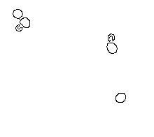
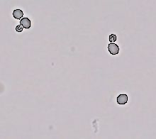

# Single and Budded Yeast Area Measurement

## Abstract

## Introduction

## Methods

### Required Input

### Image Pre-processing

The input image is first processed with the Canny edge detection algorithm [1]. This particular algorithm is selected over other algorithms to reduce background noise's interference with the results.

The specific Canny edge detection implementation in use here is the one within the CV2 module [2]. The `cv2.Canny` function therein takes two parameters in addition to the image being analyzed: a lower threshold and a higher threshold. These values alter the sensitivity of the algorithm and may need to be altered depending on the thickness of cell walls. It is important to note when editing this parameter that if the thresholds are set to be too low, edges of small buds may appear where they should not because of unfiltered interference. On the other hand, if the thresholds are too high, the algorithm may miss sides of yeast leaving incomplete area measurements.

The function outputs a black and white image, with black being background and white being the detected outlines of cells. For our purposes, we invert the image such that the background is white and the cell outlines are black, as shown in Figure 1. In Figure 2 you can see the outlines overlayed on the original image.

Figure 1.

Figure 2.

### Filling Outlines

All of the outlines discovered by the Canny edge detection algorithm need to be filled in to find the areas of any of the yeast. In order to do this, the image is searched row by row for the first black pixel it encounters.

After a black pixel is found, its coordinate is added to a Queue. Until the Queue is empty, an item is taken from it and added to a list of found edge pixels. Any of the 8 pixels surrounding that coordinate that are also black are then added to the same Queue. 

Once the Queue is empty, the area of the yeast is ready to be filled based on the list of found edge pixels. A simple flood fill is insufficient due to the gaps in some of the outlines, so a more sophisticated methodology is needed. In order to meet our needs, a dynamic programming approach is used wherein a two dimentional array of integers is constructed such that a bit mask can be used to determine if an edge exists anywhere in a given direction from any position in the array. 

First, a 2D array with enough width and height to accomodate the currently found outline is made. The outline coordinates are adjusted to this new coordinate plane and the integers in their positions are set to equal 0x111111111, or in integer terms 255 + 256. This means that they count as being surrounded on all sides since every bit mask will find that direction to be True, while also being differentiable from a non-outline pixel that is completely surrounded due to the additional 256 (Table 1). 

| Direction    | Bit Mask    | Integer Value |
| -----------: | :---------: | :------------ |
| Top          | 0x000000001 | 1             |
| Bottom       | 0x000000010 | 2             |
| Left         | 0x000000100 | 4             |
| Right        | 0x000001000 | 8             |
| Top Left     | 0x000010000 | 16            |
| Top Right    | 0x000100000 | 32            |
| Bottom Left  | 0x001000000 | 64            |
| Bottom Right | 0x010000000 | 128           |

Table 1. 

After all of the original pixels are marked, each direction is scanned starting from the most extreme pixels of that direction and moving towards the least extreme. For example, when the Top direction is being scanned, the array will be read from top to bottom while checking if the integer stored directly above the current one in the array evaluates to True when the bit mask for Top is applied, 0x000000001. If it is True, then the current position is also surrounded on the top and its integer value is set to reflect that. The first row is not run through because there is no row above the first row. This means that the "Top" status is accumulated as included edges are encountered, and to complete the operation each direction needs to run through the entire 2D array one time. This would ultimately run in O(8n*m) time, where n is the width of a specific outline and m is the height.

With the 2D bit mask array in place, each position in that array is evaluated based on how many sides it is surrounded by the outline. There are 8 sides in total, which includes diagonals, so if a pixel is surrounded by the outline on more than 5 sides it is in the center of a yeast. If a pixel was only surrounded on 5 sides, it has formed a 90 degree angle, which is more likely a divot outside a yeast representing the divide between two actively budding yeast. That space should not be filled, so our lower bounds for surounded sides must be 5. Pixels that are surrounded on exactly 5 sides and no more represent divoted area for our purposes. These divoted areas are marked in a special color for later analysis.

All of these inner coordinates are added to the array of edge coordinates to create a full array whose length is the area of the potential yeast.

### Categorizing Areas

 The cells in the upper left of Figure __ are in a cluster of three, but two of them appear attached to one another. Simply counting the distinct number of seperated areas to determine if the cells are budded would not work here since it would count the three cells as two, with one of them being misleadingly large. This is where the yellow color coded areas comes in. These areas represent divots in the outline of the cell. Two divots are likely the divide between a cell and its bud.

## Evaluation

For this algorithm to be used in any scientific journal or paper, the output images showing the yeast and how they were categorized should be included for review as well.

## Works Cited

1. https://www.researchgate.net/publication/224377985_A_Computational_Approach_To_Edge_Detection

2. https://docs.opencv.org/4.x/da/d22/tutorial_py_canny.html